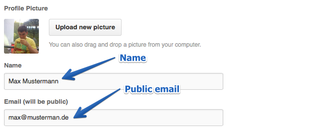

# 101companies-wiki

 

101wiki web app written using Ruby on Rails and Backbone.js

## Software dependencies

Before starting work with the application, you need to install such dependencies, if you are using Ubuntu:

    apt-get install curl nodejs build-essential libxslt-dev libxml2-dev mongodb zlib1g-dev libreadline-dev libssl-dev libcurl4-openssl-dev

For OSX there are such dependencies, that can be installed via [homebrew](http://brew.sh/):

    brew install mongodb node

## Ruby

With OSX you already have Ruby (e.g. 2.0.0p247 for Mavericks).

If you are using Ubuntu you can install ruby via [rvm](http://rvm.io) or [rbenv](https://github.com/sstephenson/rbenv/).

This app was tested with ruby 1.9.3 and higher up to 2.1

## Installing the app

At first you need to install **bundler** gem.

    gem install bundler

Now you need go to the project folder und install app:

    bundle install --path vendor/bundle

If you have troubles with installing gem on OSX and have error:

     clang: error: unknown argument: '-multiply_definedsuppress' [-Wunused-command-line-argument-hard-error-in-future]

Add to your .bashrc (.bash_profile/.zshrc/whatever you have) and open new console:

    export ARCHFLAGS="-Wno-error=unused-command-line-argument-hard-error-in-future"

After installing mongodb you need to start it and then launch application with:

    bundle exec rails server

## Admin rights

To be signed in you need to have GitHub account with **name** and **public email** in GitHub profile.

If you have been successfully signed in, you can set another role to your user:

    bundle exec rake change_role

You will be asked for your email and new role. Just type email from your GitHub account and role **admin**.

## Populating db

You need to have **default** 101companies password before.
You need to execute this task:

    bundle exec rake import_production_db_to_local_dev_db

## Contributing

If you make improvements to this application, please share with others.

*   Fork the project on GitHub.
*   Make your feature addition or bug fix.
*   Commit with Git.
*   Send a pull request.

If you add functionality to this application, create an alternative implementation, or build an application that is similar, please contact me and I’ll add a note to the README so that others can find your work.
